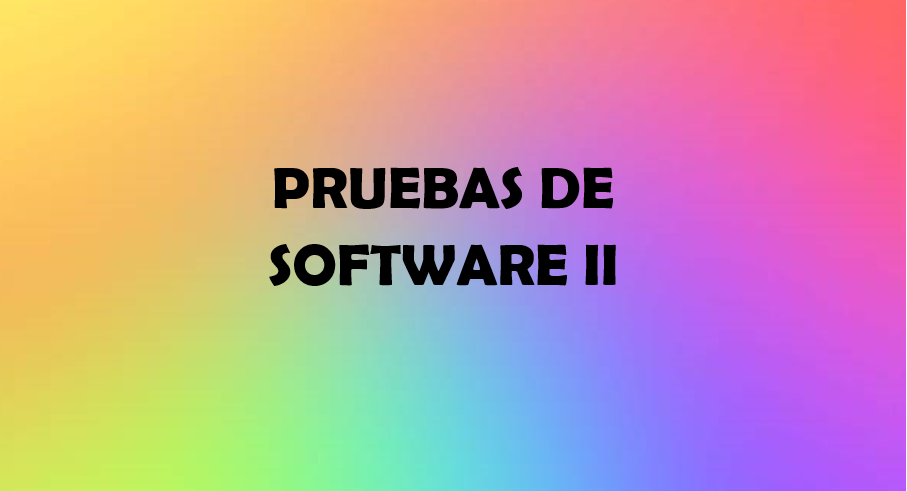

  

Repositorio diseñado para **presentar proyectos y actividades** de la asignatura _Pruebas de Software II_.  

---

## 📅 Estado actual
🚧 **En construcción** — Próximamente se añadirán entregables, actividades y documentación.

---

## 🛠 Herramientas (planeadas)
- ☕ Java  
- 🐙 GitHub  
- 🧪 JUnit (posiblemente)

---

## ✨ Autor
**Dafne Julieth**  
